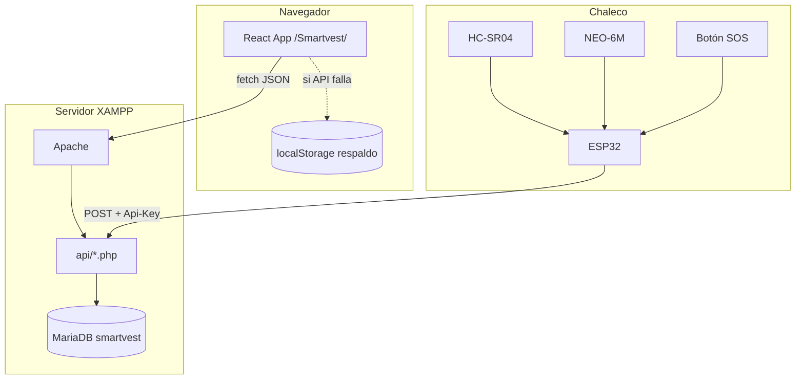
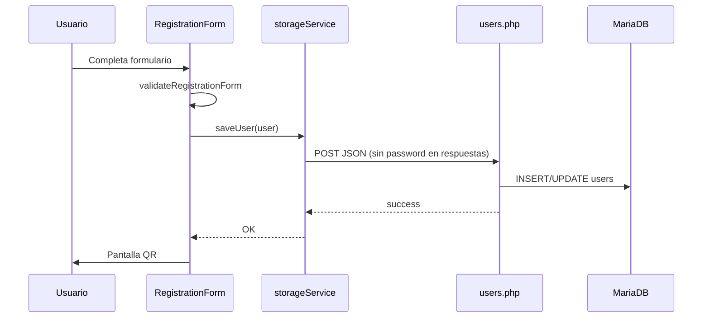
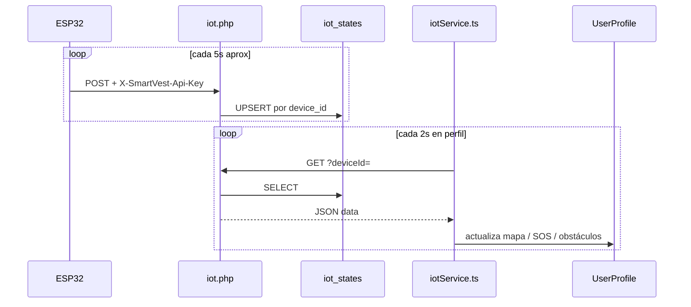

# Arquitectura del sistema

Cómo se relacionan la web, la API, la base de datos y el chaleco ESP32.

---

## Diagrama de componentes

---

## Carpetas del frontend (sin `src/`)

El proyecto coloca el código React en la **raíz** del repositorio (convención histórica del repo):

| Ruta | Contenido |
|------|-----------|
| `App.tsx` | Navegación entre pantallas (`AppScreen` enum) |
| `index.tsx` | Montaje React + `ToastProvider` |
| `components/` | UI: Landing, Login, Registration, QR, Profile, etc. |
| `services/` | Lógica de red y estado cliente |
| `utils/` | Funciones puras reutilizables |
| `types.ts` | Interfaces `UserData`, `IotData` |

### Pantallas (`AppScreen`)

| Valor | Pantalla |
|-------|----------|
| `LANDING` | Página de inicio / marketing |
| `LOGIN` | Usuario+contraseña o ID manual |
| `REGISTER` | Formulario de registro |
| `QR_VIEW` | QR tras registro exitoso |
| `PROFILE` | Monitoreo + datos médicos |

### Parámetros URL

| Parámetro | Efecto |
|-----------|--------|
| `?uid=<uuid>` | Abre perfil si el usuario existe en el servidor/local |
| `?data=<base64>` | Importa perfil público embebido en el enlace (modo portable) |

---

## Flujo de datos: registro de usuario

---

## Flujo de datos: telemetría IoT

### Estado de conexión en la UI

`iotService.ts` clasifica:

| Estado | Significado |
|--------|-------------|
| `connecting` | Primera consulta en curso |
| `online` | Datos recibidos hace menos de 30 s |
| `stale` | Sin respuesta reciente o datos viejos |
| `offline` | Sin fila en BD para ese `deviceId` |

---

## Resolución de rutas API desde el navegador

El frontend **no** usa URL fija `http://localhost/api`. Calcula la base según la ruta actual:

- Si la URL es `http://localhost/Smartvest/` → API en `/Smartvest/api/`
- Implementado en `getApiBasePath()` dentro de `storageService.ts` e `iotService.ts`

---

## Despliegue en XAMPP

1. `npm run build` → genera `dist/`.
2. `scripts/deploy-xampp.sh` → copia todo el repo a `htdocs/Smartvest`, sustituye `index.html` y `assets/` por los de `dist/`.
3. Apache sirve PHP desde `api/` en la misma carpeta.

**Importante:** siempre **build antes de deploy** para no servir JavaScript antiguo.

---

## Spec Kit (organización del proyecto)

El repo incluye [GitHub Spec Kit](https://github.com/github/spec-kit):

- `.specify/` — plantillas y scripts SDD.
- `.cursor/skills/speckit-*` — comandos como `/speckit-specify`, `/speckit-plan`.
- `specs/001-web-platform-audit/` — auditoría web documentada.
- `.specify/memory/constitution.md` — principios del proyecto (seguridad, IoT, deploy).

---

## Siguiente lectura

- [API y base de datos](./API.md)
- [Funcionalidades](./FUNCIONALIDADES.md)
