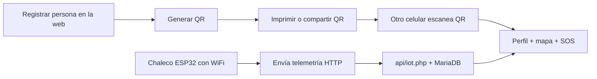

# ¿Qué es SmartVest?

## En una frase

SmartVest es un **sistema de emergencia** que une tres piezas: una **aplicación web** con perfil médico y QR, un **chaleco electrónico** (ESP32 + sensores), y una **base de datos** que guarda usuarios y la última posición/estado del dispositivo.

## ¿Qué problema intenta resolver?

Las personas con discapacidad visual pueden necesitar:

- Llevar **datos médicos y de contacto** accesibles en una emergencia (alergias, tipo de sangre, teléfono del familiar).
- **Detectar obstáculos** delante con sensores y alertas (vibración, sonido).
- Permitir que un **cuidador vea ubicación y SOS** si algo grave ocurre.

SmartVest concentra el registro, el QR para terceros, y el monitoreo del chaleco en una sola plataforma web local (o desplegable en Internet).

## ¿Quién usa cada parte?

| Rol | Qué hace |
|-----|----------|
| **Usuario del chaleco** | Usa el hardware; no necesita manejar la web a diario |
| **Familiar / cuidador** | Registra el perfil, imprime QR, abre el perfil para ver mapa y SOS |
| **Personal médico / terceros** | Escanea QR y ve datos de emergencia (texto o enlace web) |
| **Desarrollador** | Mantiene React, PHP, MariaDB y firmware ESP32 |

## Flujo típico de uso

1. **Registro:** nombre, cédula, sangre, contacto de emergencia, usuario/contraseña, ID del chaleco (`VEST-001`, etc.).
2. **QR:** modo texto (sin internet), enlace con datos embebidos, o enlace solo con ID.
3. **Monitoreo:** al abrir el perfil, la web pregunta cada ~2 s el último estado del `deviceId` vinculado.
4. **Emergencia:** si el botón SOS del chaleco se activa:
   - alerta local (buzzer + vibrador);
   - pantalla roja y notificación en el perfil web del cuidador;
   - **SMS al cuidador** (0963930791 vía SIM800L) — ver [SMS-SOS-EMERGENCIA.md](./SMS-SOS-EMERGENCIA.md).

## Qué NO es (alcance actual)

- No es una app móvil nativa (es web responsive; admite PWA e instalación en pantalla de inicio).
- No sustituye bastón ni perro guía; complementa detección a nivel del pecho con un ultrasonido frontal.
- No incluye cámaras con IA como productos comerciales premium (ver [COMPARATIVA-MERCADO.md](./COMPARATIVA-MERCADO.md)).
- No mide batería hasta que la PCB incorpore divisor al ADC del ESP32.
- No usa MQTT; telemetría por HTTP y mapa embebido de Google.
- La validación de dirección con IA es **opcional** y corre en el **servidor** (no en el navegador).

## Documentación ampliada

| Tema | Archivo |
|------|---------|
| Mercado y competidores | [COMPARATIVA-MERCADO.md](./COMPARATIVA-MERCADO.md) |
| Plan de mejoras | [ROADMAP-MEJORAS.md](./ROADMAP-MEJORAS.md) |
| Buzzer / vibrador / SOS | [ALERTAS-ACCESIBLES.md](./ALERTAS-ACCESIBLES.md) |
| IP fija del servidor | [SERVIDOR-FIJO-LAN.md](./SERVIDOR-FIJO-LAN.md) |
| SMS de emergencia (0963930791 cuidador) | [SMS-SOS-EMERGENCIA.md](./SMS-SOS-EMERGENCIA.md) |
| Presentación / feria | [GUIA-EXPOSICION.md](./GUIA-EXPOSICION.md) |
| Siguiente fase IA | [ROADMAP-VISION-IA.md](./ROADMAP-VISION-IA.md) |
| Plan v2 (próxima modificación) | [SMARTVEST-V2-PLAN.md](./SMARTVEST-V2-PLAN.md) |
| Hardware más pequeño (v2) | [HARDWARE-COMPACTO-FUTURO.md](./HARDWARE-COMPACTO-FUTURO.md) |

## Relación con el hardware

El firmware del ESP32 lee ultrasonido (HC-SR04), GPS (NEO-6M), botón SOS, y opcionalmente GSM (SIM800L). Los detalles de pines y compilación están en [firmware/esp32/platformio-smartvest/README.md](../firmware/esp32/platformio-smartvest/README.md).

## Siguiente lectura

- [Tecnologías](./TECNOLOGIAS.md)
- [Funcionalidades completas](./FUNCIONALIDADES.md)
