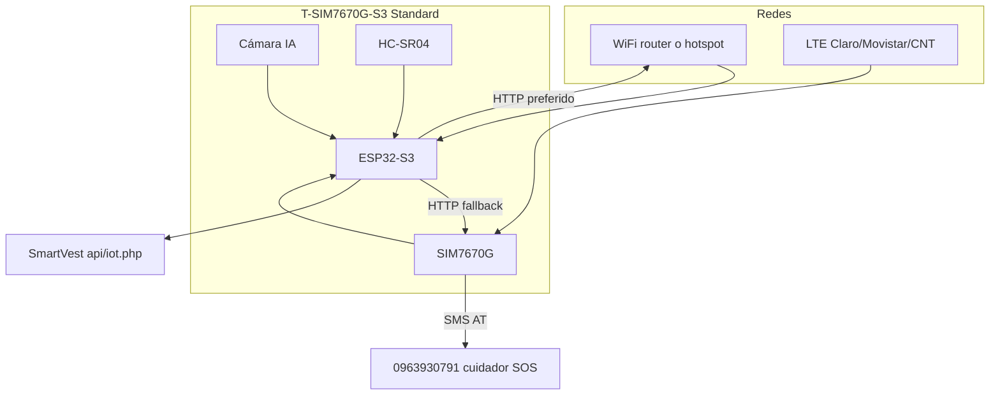

# SmartVest v2 — precios, Ecuador y conectividad (WiFi + datos móviles + SMS)

Guía para decidir compra de hardware y SIM en **Ecuador**, alineada con la idea:

- Mantener **WiFi** cuando hay red (casa, colegio, teléfono en modo hotspot).
- Usar **datos móviles (LTE)** del chip cuando no hay WiFi (calle, campo).
- Seguir enviando **SMS** de emergencia por la red celular.

---

## 1. Aclaración importante: WiFi ≠ datos móviles

En la placa integrada (ESP32-S3 + módem) conviven **dos radios distintas**:

| Radio | Qué es | Qué necesitas | Para SmartVest |
|-------|--------|---------------|----------------|
| **WiFi** (2,4 GHz) | Internet por router / hotspot del celular | SSID + clave (o hotspot) | Igual que hoy: `http://IP/Smartvest/api/iot.php` |
| **LTE (4G)** | Internet por red **Claro / Movistar / CNT** | **Nano-SIM** con plan de datos | Chaleco envía telemetría sin depender del WiFi de casa |
| **SMS** | Mensaje de texto por red GSM/LTE | Misma SIM (plan con SMS o saldo) | SOS al cuidador **0963930791** (o el que configures) |

**No** se “activa WiFi para usar datos móviles”. Son canales paralelos en firmware:

```text
Si WiFi conectado y servidor alcanzable  →  POST por WiFi (más barato, más rápido)
Si no hay WiFi pero hay LTE registrada   →  POST por HTTP/TCP por LTE (TinyGSM)
Si pulsa SOS                              →  SMS por AT del módem (independiente del WiFi)
```

El ESP32-S3 **sí puede** tener WiFi y LTE activos a la vez (como un celular en casa con WiFi + 4G de respaldo).

---

## 2. Compatibilidad con operadores en Ecuador

### Bandas 4G LTE usadas (referencia 2024–2026)

| Operador | 4G LTE principal | 3G / 2G respaldo |
|----------|------------------|------------------|
| **Claro** | **B4** (1700/2100 MHz AWS) | B5 (850 MHz) |
| **Movistar** | **B2** (1900 MHz); también B4 en parte del país | B5 (850 MHz) |
| **CNT** | **B4** y **B28** (700 MHz) | B2 (1900 MHz) |
| **Tuenti** (MVNO Movistar) | B2 (red Movistar) | Igual Movistar |

Fuentes: [Kimovil Ecuador](https://www.kimovil.com/en/frequency-checker/EC), [Android Jefe LTE Ecuador](https://www.androidjefe.com/4g-lte-ecuador/).

### ¿El módem LilyGO / SIMCom sirve?

| Variante módem | Bandas LTE FDD relevantes | ¿Ecuador? |
|----------------|---------------------------|-----------|
| **SIM7670G** (T-SIM7670G-S3) | B1, **B2**, **B3**, **B4**, B5, B7, B8, B12, B13, B18, B19, B20, B25, B26, **B28**, B66 | **Sí** — cubre B2, B4, B28 |
| **A7670G** (global) | Incluye B2, B4, B28 (familia A7670) | **Sí** — variante **G** recomendada |
| **A7670E** | Enfocada Europa / parte Asia / Sudamérica limitada | **Evitar** como primera opción en EC |
| **A7670SA** | Sudamérica / Oceanía | **Sí** — alternativa regional |

**Recomendación SmartVest v2 en Ecuador:**

1. **Placa:** [LilyGO T-SIM7670G-S3 **Standard**](https://lilygo.cc/products/t-sim-7670g-s3) (módem **SIM7670G**, región **G = Global**).  
2. **No confundir** con SKU solo **A7670E** (Europa/SEA).  
3. En tienda, pedir explícitamente: **7670G** o **SIM7670G**, no “A7670” genérico sin letra.

### Cobertura práctica

- **Claro:** mejor cobertura en zona rural (líder ~2/3 mercado).  
- **Movistar:** buena en ciudades (Quito, Guayaquil, Cuenca).  
- **CNT:** fuerte en ciudades; revisar mapa en zona rural.  
- Para Quinindé / zona costa norte: validar con mapas oficiales antes de comprar SIM de datos.

Enlaces cobertura:

- Claro: https://www.claro.com.ec/personas/servicios/servicios-moviles/cobertura/
- Movistar: https://www.movistar.com.ec/productos-y-servicios/cobertura
- CNT: http://gis.cnt.com.ec/apppublico/

---

## 3. Precios orientativos SmartVest v2 (USD)

Precios **aproximados** (mayo 2026, importación + envío pueden sumar 15–40 % en Ecuador).

### Placa principal

| Artículo | SKU / nota | Precio ref. |
|----------|------------|-------------|
| **T-SIM7670G-S3 Standard** (ESP32-S3 + LTE + GNSS + **cámara**) | LilyGO [H802] | **~40–55 USD** ([~40 USD LilyGO](https://lilygo.cc/products/t-sim-t-a-series-standard-edition)) |
| T-SIM7670G-S3 **sin** Standard (sin interfaz cámara) | [H707] | **~39–47 USD** |
| T-A7670G-S3 Standard (módem A7670G) | [H799] | Similar rango ~40–55 USD |

**Para SmartVest v2:** comprar **Standard [H802]** (cámara + QWIIC + mejor bajo consumo).

### Periféricos (estimado)

| Artículo | Precio ref. |
|----------|-------------|
| Módulo cámara OV2640 / OV3660 (si no viene incluido) | 8–15 USD |
| Antenas LTE + GNSS (a veces incluidas) | 5–15 USD |
| Nano-SIM + adaptador | 1–3 USD |
| Batería LiPo / 18650 holder (placa trae holder) | 5–12 USD |
| HC-SR04 + buzzer + motor (mismos que hoy) | 5–10 USD |
| PCB / caja mecánica chaleco (prototipo) | 20–80 USD (diseño propio) |

### Conectividad recurrente (Ecuador, mensual)

| Concepto | Orden de magnitud |
|--------|------------------|
| Plan prepago **solo datos** (Claro/Movistar 2–5 GB) | ~5–15 USD/mes |
| Plan con **datos + SMS** | ~8–20 USD/mes |
| SMS avulsos SOS (pocos al mes) | Centavos por SMS en prepago |

**Nota:** IoT en LTE Cat-1 consume poco si solo envías JSON cada 5 s (~KB/min). Un plan pequeño suele bastar para piloto; monitorizar consumo en primer mes.

### Comparación con prototipo actual (orden de magnitud)

| Concepto | Actual (módulos sueltos) | SmartVest v2 (integrado) |
|----------|--------------------------|---------------------------|
| Placas / módulos | DevKit + SIM800 + GPS + CAM ≈ 35–70 USD | Una placa ~40–55 USD |
| Cables / PCB | Grande, más mano de obra | Menor |
| SIM | 2G GPRS (SIM800) | 4G LTE (más compatible a futuro) |
| Consumo / antenas | Varias antenas | 2 antenas (LTE+GNSS) típico |

---

## 4. Arquitectura de conectividad recomendada (firmware v2)



### Reglas de firmware sugeridas

1. **Telemetría:** intentar WiFi → si falla 30 s, usar `modem.gprsConnect()` + HTTP por LTE.  
2. **SOS:** siempre SMS por módem (como hoy con SIM800, vía TinyGSM en 7670).  
3. **GPS:** GNSS del SIM7670G (un UART menos que NEO-6M suelto).  
4. **IA cámara:** local en S3; opcional subir solo `camScore`, no video (ahorra datos).

Librería de referencia: [LilyGo-Modem-Series](https://github.com/Xinyuan-LilyGO/LilyGo-Modem-Series) (fork TinyGSM para A7670/SIM7670).

---

## 5. Qué comprar concretamente (lista corta Ecuador)

| # | Ítem | Verificar |
|---|------|-----------|
| 1 | LilyGO **T-SIM7670G-S3 Standard** [H802] | Texto en caja: SIM7670**G**, Standard |
| 2 | Nano-SIM **Claro o Movistar** prepago | Plan con datos + SMS |
| 3 | Activar datos y probar registro LTE en Quito/Quinindé | `AT+CREG?`, `AT+CGATT?` |
| 4 | Cámara OV compatible (si no trae) | Pinout Standard en wiki LilyGO |
| 5 | Antenas LTE y GNSS bien conectadas | Sin corto con USB |

**Evitar:** módulo solo **A7670E** si el vendedor no confirma bandas B2/B4/B28.

---

## 6. SIM y APN (Ecuador) — notas para firmware

APN típicos (confirmar en tarjeta / web del operador; pueden cambiar):

| Operador | APN habitual (referencia) |
|----------|---------------------------|
| Claro | `internet.porta.com.ec` o `internet.claro.com.ec` (verificar ficha actual) |
| Movistar | `internet.movistar.com.ec` |
| CNT | `internet.cnt.net.ec` |

En firmware v2: configurar APN en `smartvest_config.h` igual que WiFi URL.

---

## 7. Relación con el software actual

| Hoy (v1) | v2 (objetivo) |
|----------|---------------|
| Solo WiFi a IP fija Mac/XAMPP | WiFi **o** LTE a misma API |
| SMS SIM800L | SMS SIM7670G (misma lógica AT) |
| GPS NEO-6M | GNSS integrado en módem |
| ESP32-CAM por UART | Cámara en misma placa Standard |
| Sin IA en repo | Edge Impulse / ESP-DL (ver [ROADMAP-VISION-IA.md](./ROADMAP-VISION-IA.md)) |

La API PHP (`iot.php`) **no cambia** el contrato si sigues enviando el mismo JSON por HTTP; solo cambia **cómo** llega el paquete (WiFi vs LTE).

---

## 8. Decisión registrada

| Tema | Elección |
|------|----------|
| País | Ecuador |
| Operadores objetivo | Claro y/o Movistar (validar CNT si aplica) |
| Módem | **SIM7670G** o **A7670G** (no E) |
| Placa | **T-SIM7670G-S3 Standard** |
| Conectividad | WiFi primario + **LTE datos** respaldo + **SMS** SOS |
| Presupuesto placa | ~**45–60 USD** + envío + periféricos |

---

## 9. Enlaces

- [HARDWARE-COMPACTO-FUTURO.md](./HARDWARE-COMPACTO-FUTURO.md) — comparativa global de placas  
- [ROADMAP-VISION-IA.md](./ROADMAP-VISION-IA.md) — IA como complemento ultrasonido  
- [LilyGO T-SIM7670G-S3](https://lilygo.cc/products/t-sim-7670g-s3)  
- [Model comparison LilyGO](https://github.com/Xinyuan-LilyGO/LilyGo-Modem-Series/blob/main/docs/model_comparison.md)  
- [SIM7670G datasheet (bandas)](https://www.simcom.com/product/SIM7670G.html)

*Actualizar precios y APN cuando compres; los valores de tienda cambian.*
