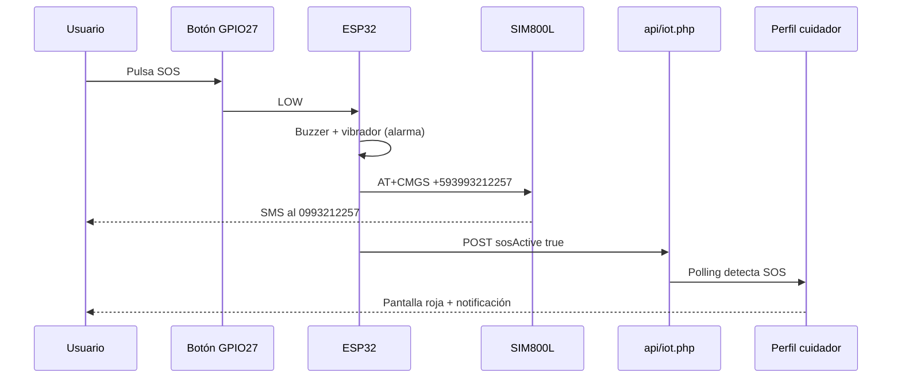

# Alerta SOS — SMS, web y hardware

Documentación oficial del canal **SMS por SIM800L** en SmartVest, para desarrollo, mantenimiento y **exposición del proyecto**.

---

## Resumen

Cuando el usuario pulsa el **botón SOS** del chaleco (GPIO27), el sistema ejecuta **tres canales de alerta** en paralelo:

| Canal | Destino | Tecnología | Estado en el proyecto |
|-------|---------|------------|------------------------|
| **Local** | Persona con el chaleco | Buzzer + motor vibrador | Activo |
| **Web** | Cuidador con perfil abierto | HTTP → MariaDB → perfil React | Activo |
| **SMS** | Contacto de emergencia | SIM800L (GSM) | Activo (configurado) |

---

## Número de emergencia SMS

| Campo | Valor |
|-------|--------|
| Número local (Ecuador) | **0993212257** |
| Formato internacional (AT+CMGS) | **+593993212257** |
| Usuario vinculado en BD | Anthony Perez — `deviceId` **VEST-001** |
| Teléfono en perfil web (`emergency_phone`) | **0993212257** (mismo contacto) |

El prefijo `0` del celular ecuatoriano se reemplaza por el código de país `593` en el firmware.

---

## Configuración en firmware

Archivo: `firmware/esp32/platformio-smartvest/include/smartvest_config.h`

```c
#define SMARTVEST_ENABLE_SIM800 true
#define SMARTVEST_SOS_PHONE "+593993212257"
```

Plantilla versionada (sin credenciales WiFi): `include/smartvest_config.h.example`

### Cambiar el número en el futuro

1. Edita `SMARTVEST_SOS_PHONE` con formato `+5939XXXXXXXX`.
2. Opcional: actualiza `emergency_phone` en MariaDB para el usuario del chaleco.
3. Recompila y sube firmware:
   ```bash
   cd firmware/esp32/platformio-smartvest
   pio run -t upload --upload-port /dev/cu.usbserial-0001
   ```

---

## Contenido del SMS

Se envía **una vez por cada pulsación** del SOS (no se repite mientras se mantiene presionado).

Ejemplo:

```text
ALERTA SOS SmartVest
deviceId: VEST-001
Distancia: 214 cm
Mapa: https://maps.google.com/?q=-0.180653,-78.467834
```

Si el GPS no tiene fix, la última línea indica que abra el perfil web del cuidador.

---

## Hardware GSM (esquema del proyecto)

| Señal | GPIO ESP32 | Conexión |
|-------|------------|----------|
| RX ESP32 ← TX módulo | 16 | SIM800L TX → ESP32 RX |
| TX ESP32 → RX módulo | 17 | ESP32 TX → SIM800L RX |

**Requisitos para que el SMS funcione en exposición:**

- Módulo **SIM800L** soldado o cableado según la PCB.
- **Antena GSM** conectada.
- **SIM** con saldo y red móvil (Movistar/Claro/etc.).
- Alimentación estable del módulo (picos de corriente al transmitir).

---

## Flujo técnico



---

## Código de referencia

| Archivo | Función |
|---------|---------|
| `firmware/.../src/main.cpp` | Detección SOS, `sendSms()`, `applySosAlertPattern()` |
| `firmware/.../include/smartvest_config.h` | `SMARTVEST_ENABLE_SIM800`, `SMARTVEST_SOS_PHONE` |
| `api/iot.php` | Guarda `sos_active` en `iot_states` e historial |
| `components/UserProfile.tsx` | Overlay SOS, notificaciones navegador, `tel:` emergencia |

---

## Prueba y diagnóstico

### Monitor serial (115200 baud)

```bash
cd firmware/esp32/platformio-smartvest
pio device monitor --port /dev/cu.usbserial-0001
```

Al pulsar SOS deberías ver líneas como:

```text
SMS destino: +593993212257
SMS SOS -> OK
```

Si falla:

| Mensaje serial | Causa probable |
|----------------|----------------|
| `modulo GSM sin respuesta AT` | SIM800 apagado, TX/RX invertidos o mal baud (9600) |
| `timeout esperando prompt >` | SIM sin red o módulo no registrado |
| `SMS SOS -> FALLO` | Sin saldo, antena, o número mal formateado |

### Prueba web (sin SMS)

En `http://localhost/Smartvest/`, perfil de **VEST-001** → sección simulación (solo localhost) → **Activar SOS**, o pulsa el botón físico con XAMPP y WiFi activos.

---

## Seguridad y privacidad (exposición)

- El número de emergencia aparece en documentación y configuración de ejemplo porque es el **contacto designado del piloto**, no un dato aleatorio.
- **No** publiques en exposiciones públicas: contraseñas WiFi, `SMARTVEST_IOT_API_KEY` de producción ni `api/config.local.php`.
- Para otra institución, cambia el número en `smartvest_config.h` y en la base de datos.

---

## Relación con otros documentos

- [ALERTAS-ACCESIBLES.md](./ALERTAS-ACCESIBLES.md) — umbrales buzzer/vibrador
- [CONFIGURACION-ESP32.md](./CONFIGURACION-ESP32.md) — WiFi, flash, montaje PCB
- [GUIA-EXPOSICION.md](./GUIA-EXPOSICION.md) — guion para presentar el proyecto
- [API.md](./API.md) — contrato `iot.php`
